# Codebase Dependency DAG (Extracted)

Determinism: no timestamps; stable ordering.

## Nodes

- `nps.certification`
- `nps.core`
- `nps.kernel`
- `nps.models`
- `nps.phase_c`
- `nps.phase_d`
- `nps.phases.phase_0a`
- `nps.phases.phase_0b`
- `nps.phases.phase_0c`
- `nps.phases.phase_a`
- `nps.phases.phase_a_prime`
- `nps.phases.phase_b`
- `nps.phases.phase_b_prime`
- `nps.phases.phase_c`
- `nps.phases.phase_c_prime`
- `nps.symbols`
- `nps.validation`

## Edges

- `nps.certification` -> `nps.kernel`
- `nps.core` -> `nps.kernel`
- `nps.models` -> `nps.core`
- `nps.phase_c` -> `nps.core`
- `nps.phase_d` -> `nps.core`
- `nps.phase_d` -> `nps.validation`
- `nps.phases.phase_0a` -> `nps.certification`
- `nps.phases.phase_0a` -> `nps.kernel`
- `nps.phases.phase_0b` -> `nps.validation`
- `nps.phases.phase_0c` -> `nps.core`
- `nps.phases.phase_0c` -> `nps.validation`
- `nps.phases.phase_a` -> `nps.certification`
- `nps.phases.phase_a` -> `nps.core`
- `nps.phases.phase_a` -> `nps.kernel`
- `nps.phases.phase_a` -> `nps.models`
- `nps.phases.phase_a` -> `nps.phases.phase_0a`
- `nps.phases.phase_a` -> `nps.symbols`
- `nps.phases.phase_a` -> `nps.validation`
- `nps.phases.phase_a_prime` -> `nps.certification`
- `nps.phases.phase_a_prime` -> `nps.core`
- `nps.phases.phase_a_prime` -> `nps.symbols`
- `nps.phases.phase_b` -> `nps.core`
- `nps.phases.phase_b` -> `nps.phases.phase_0b`
- `nps.phases.phase_b` -> `nps.validation`
- `nps.phases.phase_b_prime` -> `nps.validation`
- `nps.phases.phase_c` -> `nps.phases.phase_0c`
- `nps.phases.phase_c` -> `nps.validation`
- `nps.phases.phase_c_prime` -> `nps.validation`
- `nps.symbols` -> `nps.certification`
- `nps.symbols` -> `nps.core`
- `nps.symbols` -> `nps.kernel`
- `nps.validation` -> `nps.core`
- `nps.validation` -> `nps.kernel`

## Mermaid

```mermaid
flowchart TD
  nps_certification[nps.certification]
  nps_core[nps.core]
  nps_kernel[nps.kernel]
  nps_models[nps.models]
  nps_phase_c[nps.phase_c]
  nps_phase_d[nps.phase_d]
  nps_phases_phase_0a[nps.phases.phase_0a]
  nps_phases_phase_0b[nps.phases.phase_0b]
  nps_phases_phase_0c[nps.phases.phase_0c]
  nps_phases_phase_a[nps.phases.phase_a]
  nps_phases_phase_a_prime[nps.phases.phase_a_prime]
  nps_phases_phase_b[nps.phases.phase_b]
  nps_phases_phase_b_prime[nps.phases.phase_b_prime]
  nps_phases_phase_c[nps.phases.phase_c]
  nps_phases_phase_c_prime[nps.phases.phase_c_prime]
  nps_symbols[nps.symbols]
  nps_validation[nps.validation]
  nps_certification --> nps_kernel
  nps_core --> nps_kernel
  nps_models --> nps_core
  nps_phase_c --> nps_core
  nps_phase_d --> nps_core
  nps_phase_d --> nps_validation
  nps_phases_phase_0a --> nps_certification
  nps_phases_phase_0a --> nps_kernel
  nps_phases_phase_0b --> nps_validation
  nps_phases_phase_0c --> nps_core
  nps_phases_phase_0c --> nps_validation
  nps_phases_phase_a --> nps_certification
  nps_phases_phase_a --> nps_core
  nps_phases_phase_a --> nps_kernel
  nps_phases_phase_a --> nps_models
  nps_phases_phase_a --> nps_phases_phase_0a
  nps_phases_phase_a --> nps_symbols
  nps_phases_phase_a --> nps_validation
  nps_phases_phase_a_prime --> nps_certification
  nps_phases_phase_a_prime --> nps_core
  nps_phases_phase_a_prime --> nps_symbols
  nps_phases_phase_b --> nps_core
  nps_phases_phase_b --> nps_phases_phase_0b
  nps_phases_phase_b --> nps_validation
  nps_phases_phase_b_prime --> nps_validation
  nps_phases_phase_c --> nps_phases_phase_0c
  nps_phases_phase_c --> nps_validation
  nps_phases_phase_c_prime --> nps_validation
  nps_symbols --> nps_certification
  nps_symbols --> nps_core
  nps_symbols --> nps_kernel
  nps_validation --> nps_core
  nps_validation --> nps_kernel
```

